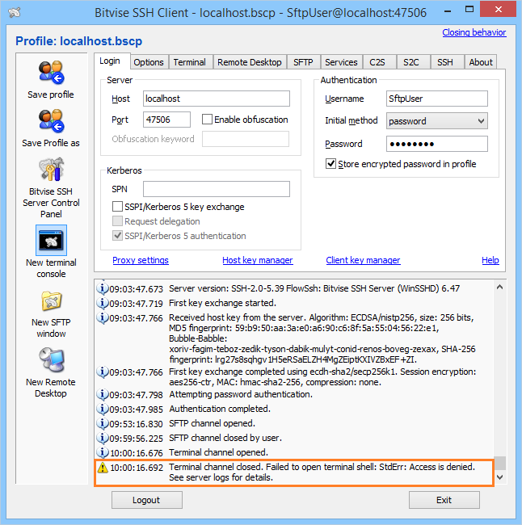
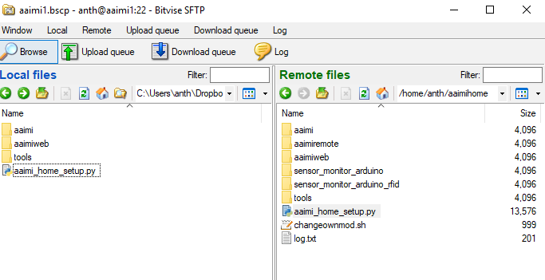

# OzSTAR Tutorial 中文版

开始之前，请参考[OzSTAR官方文档](https://supercomputing.swin.edu.au/)获取账号`<user_name>`和密码`<password>`并熟悉基本操作。

OzSTAR的运行基于CentOS7操作系统。系统无原生图形化界面，因此我们的大部分操作将会依赖命令行（command line）。如果您有过使用Ubuntu命令行的经验，那么非常幸运地，CentOS7的命令行操作与之基本一致。熟练掌握Linux命令是使用绝大部分超算集群的基础。


## 登录服务器

推荐使用[MobaXterm](https://mobaxterm.mobatek.net/)或[Bitvise](https://www.bitvise.com/download-area)等软件登录。这些软件是windows平台下具有图像化界面的ssh连接工具。相比单纯的命令行，能够方便的以图像化的形式查看、上传、下载Ozstar上的文件，同时提供了命令行工具。


### 使用MobaXTerm

打开软件并开始一个本地的终端（start local terminal）。运行：
```shell
ssh <user_name>@ozstar.swin.edu.au
```
来登录OzSTAR。首次登陆将提示用户输入密码，随后密码将默认被保存。


### 使用Bitvise

在下图所示的软件界面中:



在Host处填写: ozstar.swin.edu.au，在Port处填写: 22，在username处填写申请到的账号名`<user_name>`，Password处填写申请账号时设置的密码，然后点击Login。


## 文件传输

### 使用界面传输文件

上文提到的登录软件均具备文件浏览和传输等基本功能。如果使用这些软件来登录服务器，可使用软件自带的上传下载功能来在本地和服务器之间传输文件。比如，使用Bitvise客户端连接，可以直接在下图文件目录中以拖拽的方式上传或者下载文件。




### 使用命令行传输文件

服务器间的登录和访问（比如，在一台服务器上登录另一台服务器）一般只能通过命令行来完成。在没有界面支持的情况下，我们仍然可以通过`scp`和`rsync`命令来完成文件的传输。比如：

```shell
ssh <user_name>@ozstar.swin.edu.au
scp <another_user_name>@another_server:<file_path_of_another_server> <dst_dir_of_ozstar>
```

或

```shell
rsync <another_user_name>@another_server:<file_path_of_another_server> <dst_dir_of_ozstar>
```

可将`<another_user_name>@another_server`服务器中位于`<file_path_of_another_server>`的文件拷贝至OzSTAR服务器中的`<dst_dir_of_ozstar>`文件夹。

更多介绍详情请参考[OzSTAR Documentation on File systems and I/O](https://supercomputing.swin.edu.au/docs/1-getting_started/Filesystems.html)。


## 创建本地项目
可下载[example_project](example_project)来进行测试，那么本地的项目文件夹`<local_project_dir>` 为`download_dir/example_project`。为了验证运行环境，我们将运行其中的[program.py](example_project/program.py)文件。


### 用命令行运行程序
打开一个终端（Terminal）。无界面的Linux系统将在全局使用终端。在Windows系统中，推荐使用[PowerShell](https://github.com/PowerShell/PowerShell)以支持丰富的指令功能。通过命令
```shell
cd <project_dir>
```
进入项目文件夹。后面指令中的相对路径（relative path）将以此为根目录。因此，运行以下两命令等价:
```shell
python program.py
python <local_project_dir>/program.py
```


### 用界面运行程序

将`<project_dir>`用[VSCode](https://code.visualstudio.com/)或[PyCharm](https://www.jetbrains.com/pycharm/)等IDE打开。并在界面中操作。


如果本地环境配置正确，那么程序将会成功执行，并输出:
```
Hello
```


## 使用GIT管理项目

GIT是一种项目文件管理机制，常见的GIT平台有[GitHub](https://github.com/)和[码云（Gitee）](https://gitee.com/)。平台的使用方式类似，以GitHub为例：


1. 在GitHub上创建项目，获取`<git_url>`。

    `<git_url>`：项目仓库（repository）链接，通常以“.git”结尾。

2. 在本地的项目目录中新建并设置`.gitignore`文件，这可以将项目程序运行时产生的无关文件排除在外，其设置请参考[gitignore文档](https://git-scm.com/docs/gitignore)。

2. 在本地，在IDE界面中通过界面，或在终端中通过命令，初始化GIT并将项目同步至GitHub。
    ```shell
    git init
    git add .
    git commit -m "first commit"
    git remote add origin <git_url>
    git push -u origin master
    ```
    项目同步完成后可使用浏览器登陆`<git_url>`确认并查看云端项目文件。

4. 在OzSTAR使用命令
    ```shell
    git clone <git_url>
    ```
    将云端的项目同步至服务器。此时项目在OzSTAR的文件夹为`<ozstar_project_dir>`。使用命令
    ```shell
    cd <ozstar_project_dir>
    python program.py
    ```
    进入该文件夹并运行python程序，检查文件有效性。

5. 调试、修改python文件，如将`program.py`的内容修改为：
    ```python
    print("Modified on OzSTAR")
    ```
    保存文件，在终端中通过命令：
    ```shell
    git add .
    git commit -m "modified file output"
    git push
    ```
    将改动提交并同步至GitHub。

6. 在本地，在IDE界面中通过界面操作，或在终端中通过命令：
    ```shell
    git pull
    ```
    将改动后的项目从GitHub同步回本地。
